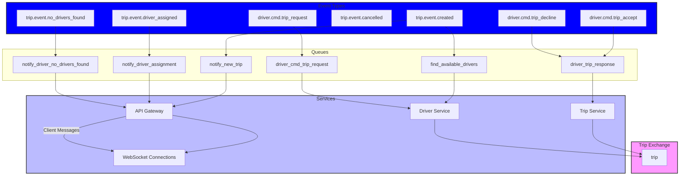

```mermaid
graph TD
    subgraph Exchange[Trip Exchange]
        TE[trip]
    end

    subgraph Queues
        Q1[find_available_drivers]
        Q2[notify_new_trip]
        Q3[notify_driver_assignment]
        Q4[notify_driver_no_drivers_found]
        Q5[driver_cmd_trip_request]
        Q6[driver_trip_response]
    end

    subgraph Events[Event Types]
        E1[trip.event.created]
        E2[trip.event.driver_assigned]
        E3[trip.event.no_drivers_found]
        E4[trip.event.cancelled]
        E5[driver.cmd.trip_request]
        E6[driver.cmd.trip_accept]
        E7[driver.cmd.trip_decline]
    end

    subgraph Services
        TS[Trip Service]
        DS[Driver Service]
        AG[API Gateway]
        WS[WebSocket Connections]
    end

    %% Event Flow
    E1 --> Q1
    E1 --> Q2
    E2 --> Q3
    E3 --> Q4
    E5 --> Q5
    E6 --> Q6
    E7 --> Q6

    %% Service Interactions
    TS --> TE
    DS --> TE
    AG --> WS

    %% Queue to Service Flow
    Q1 --> DS
    Q2 --> AG
    Q3 --> AG
    Q4 --> AG
    Q5 --> DS
    Q6 --> TS

    %% WebSocket Connections
    AG --> |Client Messages| WS

    style Exchange fill:#f9f,stroke:#333,stroke-width:2px
    style Services fill:#bbf,stroke:#333,stroke-width:2px
    style Events fill:#00f,stroke:#333,stroke-width:2px
```