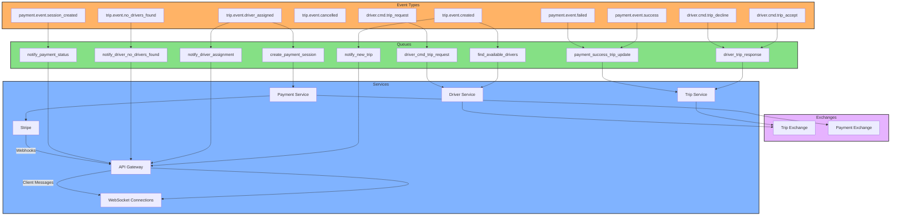

```mermaid
graph TD
    subgraph Exchanges
        TE[Trip Exchange]
        PE[Payment Exchange]
    end

    subgraph Queues
        Q1[find_available_drivers]
        Q2[notify_new_trip]
        Q3[notify_driver_assignment]
        Q4[notify_driver_no_drivers_found]
        Q5[driver_cmd_trip_request]
        Q6[driver_trip_response]
        Q7[create_payment_session]
        Q8[notify_payment_status]
        Q9[payment_success_trip_update]
    end

    subgraph Events[Event Types]
        E1[trip.event.created]
        E2[trip.event.driver_assigned]
        E3[trip.event.no_drivers_found]
        E4[trip.event.cancelled]
        E5[driver.cmd.trip_request]
        E6[driver.cmd.trip_accept]
        E7[driver.cmd.trip_decline]
        E8[payment.event.session_created]
        E9[payment.event.success]
        E10[payment.event.failed]
    end

    subgraph Services
        TS[Trip Service]
        DS[Driver Service]
        AG[API Gateway]
        WS[WebSocket Connections]
        PS[Payment Service]
        ST[Stripe]
    end

    %% Event Flow - Trip Exchange
    E1 --> Q1
    E1 --> Q2
    E2 --> Q3
    E2 --> Q7
    E3 --> Q4
    E5 --> Q5
    E6 --> Q6
    E7 --> Q6

    %% Event Flow - Payment Exchange
    E8 --> Q8
    E9 --> Q9
    E10 --> Q9

    %% Service Interactions
    TS --> TE
    DS --> TE
    PS --> PE
    AG --> WS
    PS --> ST

    %% Queue to Service Flow
    Q1 --> DS
    Q2 --> AG
    Q3 --> AG
    Q4 --> AG
    Q5 --> DS
    Q6 --> TS
    Q7 --> PS
    Q8 --> AG
    Q9 --> TS

    %% WebSocket Connections
    AG --> |Client Messages| WS

    %% Stripe Integration
    ST --> |Webhooks| AG

    style Exchanges fill:#e6b3ff,stroke:#333,stroke-width:2px
    style Services fill:#80b3ff,stroke:#333,stroke-width:2px
    style Events fill:#ffb366,stroke:#333,stroke-width:2px
    style Queues fill:#85e085,stroke:#333,stroke-width:2px
``` 